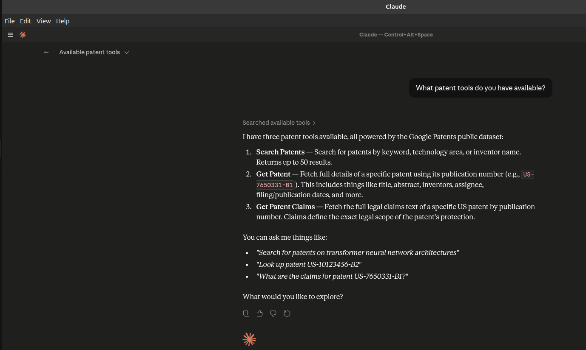

# patents-mcp

[](https://golang.org)
[](LICENSE)
[](https://glama.ai/mcp/servers/tushariitr-19/patents-mcp)

An MCP (Model Context Protocol) server for patent search and prior art discovery, powered by the Google Patents public dataset on BigQuery.

Built with the official [Go MCP SDK](https://github.com/modelcontextprotocol/go-sdk).

## Why patents-mcp?

Existing patent MCP servers are either paid, single-source, or unmaintained. `patents-mcp` is:

- **Free** — built on Google Patents public dataset (1TB/month free on BigQuery)
- **Open source** — MIT licensed
- **Production grade** — structured logging, graceful shutdown, clean architecture
- **Extensible** — each tool is self-contained, easy to add new tools

## Available Tools

| Tool | Description |
|------|-------------|
| `search_patents` | Search patents by keyword, technology area, or inventor name |
| `get_patent` | Fetch full patent details by publication number |
| `get_patent_claims` | Fetch patent claims text |

## Prerequisites

- Go 1.21+
- A Google Cloud account (free)
- BigQuery API enabled on your GCP project

## Setup

### 1. Google Cloud Setup

1. Create a GCP project at [console.cloud.google.com](https://console.cloud.google.com)
2. Enable the BigQuery API
3. Create a service account with the following roles:
   - `BigQuery Job User`
   - `BigQuery Data Viewer`
4. Download the service account JSON key

### 2. Install

```bash
git clone https://github.com/tushariitr-19/patents-mcp
cd patents-mcp
go build -o patents-mcp-server ./cmd/server/
```

### 3. Configure

```bash
export GOOGLE_APPLICATION_CREDENTIALS="/path/to/service-account.json"
export GCP_PROJECT_ID="your-gcp-project-id"

# Optional: enable debug logging
export DEBUG=true
```

## Usage with Claude Desktop

Add to your Claude Desktop config (`claude_desktop_config.json`):

```json
{
  "mcpServers": {
    "patents-mcp": {
      "command": "/path/to/patents-mcp-server",
      "env": {
        "GOOGLE_APPLICATION_CREDENTIALS": "/path/to/service-account.json",
        "GCP_PROJECT_ID": "your-gcp-project-id"
      }
    }
  }
}
```

## Screenshots

### Available Tools


## Example Prompts

Once connected to Claude Desktop:

- *"Search for patents related to transformer neural networks"*
- *"Find prior art for context-aware UI element hiding"*
- *"What patents has Google filed related to quantum computing?"*
- *"Find patents by inventor Yann LeCun"*

## Architecture

```
patents-mcp/
├── cmd/server/main.go       ← entry point, env vars, graceful shutdown
├── server/server.go         ← MCP server setup, tool registration
├── tools/
│   └── search.go            ← search_patents tool (self-contained)
├── bigquery/
│   └── client.go            ← BigQuery query execution
├── logger/
│   └── logger.go            ← structured logging via zap
└── models/
    └── patent.go            ← shared Patent struct
```

Each tool owns its own dependencies — the server is agnostic of what tools do internally. Adding a new tool is a single line in `server/server.go`.

## Contributing

PRs welcome. To add a new tool:

1. Create `tools/<toolname>.go`
2. Define your input struct and tool definition
3. Register it in `server/server.go` with one line

## License

MIT